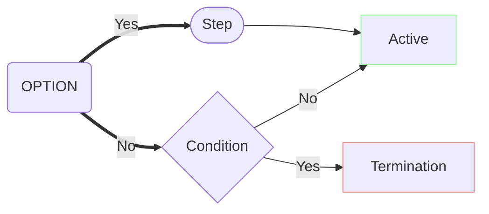
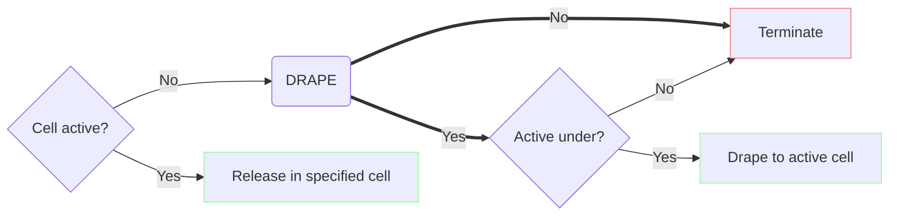
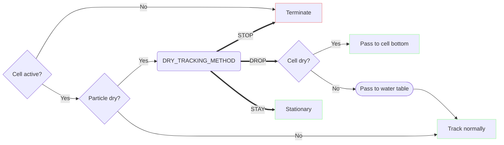

# MODFLOW 6.6.0 Particle Tracking (PRT) Model Migration Guide

This document describes how to migrate PRT models from MODFLOW 6.5.0 to 6.6.0. The particle tracker has evolved since the last release &mdash; while the basics remain the same, there are a few changes worthy of note and, in some cases, detailed explanation.

Rather than describing bug fixes and new features separately, this document is structured by topic, and mentions relevant bug fixes within each topic section. See the release notes for a complete (though less detailed) list of fixes, some of which are unrelated to any topic described here.

<!-- START doctoc generated TOC please keep comment here to allow auto update -->
<!-- DON'T EDIT THIS SECTION, INSTEAD RE-RUN doctoc TO UPDATE -->

- [Exit solve tolerance](#exit-solve-tolerance)
- [Release time selection](#release-time-selection)
  - [Explicit selections](#explicit-selections)
  - [Relative selections](#relative-selections)
  - [Periodic releases](#periodic-releases)
- [Tracking time selection](#tracking-time-selection)
- [Extended tracking](#extended-tracking)
- [Vertical tracking](#vertical-tracking)
  - [Release time](#release-time)
  - [Tracking time](#tracking-time)

<!-- END doctoc generated TOC please keep comment here to allow auto update -->

## Exit solve tolerance

The PRT model's Particle Release Point (PRP) package now provides an option `EXIT_SOLVE_TOLERANCE` which configures the tolerance to use when solving for a particle's exit location from a triangular subcell of an unstructured grid cell. This value is only used for the generalized (ternary) tracking method on vertex grids.
 
A value of 0.00001 is set by default. This value works well for many problems, but the value that strikes the best balance between accuracy and speed is problem-dependent.
 
**Note**: A tolerance that is too large can result in a particle that is close to a subcell boundary and moving nearly parallel to that boundary to terminate prematurely. If a particle is suspected to have terminated prematurely in a model based on a DISV grid, tightening EXIT_SOLVE_TOLERANCE down (say, to 1e-10) may resolve the issue.

## Release time selection

The PRT model's Particle Release Point (PRP) package is responsible for configuring when particles should be released. This can be done with explicitly provided release times, or with reference to stress periods and time steps.

### Explicit selections

Previously, explicit times were provided via a `RELEASE_TIMES` (or `RELEASE_TIMES_FILE`) variable. This pattern does not appear elsewhere in MODFLOW 6. To conform more closely to MODFLOW 6 input conventions, times must now be specified with list input, via a new `RELEASETIMES` block. The list has a single `time` column. A `DIMENSIONS` block containing an `NRELEASETIMES` variable must also be provided.

For instance, a sample PRP file in the new format:

```
BEGIN options
  PRINT_INPUT
  EXIT_SOLVE_TOLERANCE  1.00000000E-05
  EXTEND_TRACKING
END options

BEGIN dimensions
  NRELEASEPTS  9
  NRELEASETIMES  2
END dimensions

BEGIN packagedata
  1  1 1 1       0.10000000       9.10000000       0.50000000
  2  1 1 1       0.20000000       9.20000000       0.50000000
  3  1 1 1       0.30000001       9.30000001       0.50000000
  4  1 1 1       0.40000001       9.40000001       0.50000000
  5  1 1 1       0.50000000       9.50000000       0.50000000
  6  1 1 1       0.60000002       9.60000002       0.50000000
  7  1 1 1       0.69999999       9.69999999       0.50000000
  8  1 1 1       0.80000001       9.80000001       0.50000000
  9  1 1 1       0.89999998       9.89999998       0.50000000
END packagedata

BEGIN releasetimes
       0.50000000
       0.60000000
END releasetimes
```

**Note**: List-based input leaves open the possibility to provide more information via the time selection mechanism in the future, by way of additional columns.

### Relative selections

MF6.5.0 provided a `FRACTION` option for period block release settings, which could be used to release particles at an offset from the beginning of any specified time steps. This option has been removed &mdash; particle release times configured with period block settings now occur at the beginning of the specified time steps, bringing the PRP package period block settings into conformity with the period block settings in the Output Control (OC) package. For fine-grained control over release times, specify them explicitly.

### Periodic releases

In MF6.6.0, the PRP package also provides a new option to configure release times at a regular time interval, `RELEASE_TIME_FREQUENCY` accepting a double precision value.

## Tracking time selection

Similarly, the PRT model's Output Control (OC) package allows selection of times for status reporting to occur. Previously, times were provided via a `TRACK_TIMES` (or `TRACK_TIMES_FILE`) variable.

Like the PRP package, tracking times for the OC package must now be specified with list input, via a new `TRACKTIMES` block. The list has a single `time` column. A `DIMENSIONS` block containing an `NTRACKTIMES` variable must also be provided.

A sample OC file:

```
BEGIN options
  TRACK  FILEOUT  prt.trk
  TRACKCSV  FILEOUT  prt.trk.csv
  TRACK_USERTIME
END options

BEGIN dimensions
  NTRACKTIMES  1000
END dimensions

BEGIN tracktimes
       0.00000000
       0.05000000
       0.10000000
... (truncated)
```

## Extended tracking

To achieve the same behavior as with a MODFLOW 6.5.0 PRT model, the `EXTEND_TRACKING` keyword must be supplied to the PRP package. In MF6.5.0, PRT followed MODPATH 7 in "extending" particle tracking beyond the end of the simulation time, until all particles terminate, if the last stress period is steady state. While consistent with MP7, this means a particle tracking simulation may fail to halt if particles get caught in flow cycles. To guarantee termination under the default settings, MF6.6.0 introduces the `EXTEND_TRACKING` keyword to opt into tracking extension &mdash; otherwise particles will terminate at the simulation end time.

## Vertical tracking

This section describes the approach PRT takes to vertical particle motion. It is reproduced (sans diagrams) in the MF6IO guide's PRT chapter.

The motion of a particle is determined by the groundwater velocity field in which the particle is immersed. In a fully saturated cell, or the saturated portion of a partially saturated cell, the velocity field is calculated from the flows entering and exiting the cell. In a completely dry cell, or the dry portion of a partially saturated cell, the fate of a particle depends on whether the cell is an active part of the flow simulation, whether the particle is in a dry or wet part of the cell, and user-selected options.

A cell can be inactive either because it has been removed from the active simulation using the IDOMAIN array or because it is completely dry, i.e., the head in the cell is below the bottom elevation of the cell. Deactivation of completely dry cells is the default behavior in MODFLOW 6. However, when the Newton-Raphson formulation is used to solve for groundwater flow, completely dry cells remain active.

Sometimes it is convenient to avoid "stranding" particles &mdash; rather than terminating dry particles, it is often convenient instead to move them down to the saturated zone and continue tracking. PRT allows particles (and indeed configures them by default) to move instantaneously down to the water table in dry conditions. This was the only supported behavior in MF6.5.0. With MF6.6.0, PRT continues to support this behavior by default, while providing a few alternatives.

Release-time and tracking-time considerations are implemented (and thus described here) separately.

**Legend**

Diagrams use the following conventions.

* Stadium-shaped boxes represent steps or processes.
* Square boxes represent outcomes.
* Diamond boxes represent conditions (i.e. runtime state).
* Round-corner boxes represent user options.
* Thin lines represent decisions made by the program on the basis of runtime state, e.g. particle, cell, flows.
* Thick lines represent decisions made by the user by way of options.
* Green outcome boxes indicate the particle remains active.
* Red outcome boxes indicate the particle terminates.



### Release time

At release time, PRT decides whether to release each particle or terminate it unreleased.

If the cell into which the particle is being released is inactive, behavior is determined by the `DRAPE` option. If the `DRAPE` option is enabled, the particle will be released from the top-most active cell beneath it, if any. If there is no active cell underneath the particle in any layer, or if `DRAPE` is not enabled, the particle will terminate unreleased (with status code 8).

If the cell into which the particle is being released is active, the particle will be released at the user-specified location, even if that location is in the dry portion of the cell or the cell is dry-but-active.

Note that for a dry-but-active cell the `DRAPE` option has no effect. In that case, the particle is released into the cell, and its subsequent behavior can be configured using the `DRY_TRACKING_METHOD` option discussed below.



### Tracking time

During tracking, the fate of a particle depends on the status of the cell that contains the particle, whether the particle is in a wet or dry part of the cell, and the `DRY_TRACKING_METHOD` option.

A particle immersed in the groundwater flow field during a given time step can end up in an inactive cell, a dry-but-active cell, or the dry part of a partially saturated cell if the water table drops on the next time step.

A particle that finds itself in an inactive cell will terminate with status code 7. This is consistent with the behavior of MODPATH 7.

Dry-but-active cells can occur when the Newton-Raphson formulation is used to solve for groundwater flow. As discussed above, particles can be released into dry-but-active cells.

A particle in a dry-but-active cell, or above the water table in a partially saturated cell, which we call a dry particle, need not terminate. The PRP package provides a `DRY_TRACKING_METHOD` option that determines how dry particles should behave. Supported values are `DROP` (the default), `STOP`, and `STAY`.

If `DROP` is selected, or if a `DRY_TRACKING_METHOD` is unspecified, a dry particle is passed vertically and instantaneously to the water table (if the cell is partially saturated) or to the bottom of the cell (if the cell is dry). This repeats (i.e., the particle may drop through multiple cells) until it reaches the water table. Tracking then proceeds as usual. If the vertical column containing the particle is entirely dry, the particle will terminate upon reaching the bottom of the model grid.

If `STOP` is selected, dry particles will be terminated.

If `STAY` is selected, a dry particle will remain stationary until a) the water table rises and tracking can continue, b) the particle terminates due to reaching its `STOPTIME` or `STOPTRAVELTIME`, or c) the simulation ends.



**Note**: In MF6.5, behavior was as described by `DROP`, with one major exception: lack of an exit face (i.e. any face with outgoing flow) took precedence over cell saturation; a particle finding itself in a dry cell with no outgoing flow would previously terminate, where if `DROP` is selected (or a dry tracking method unspecified) the pass-to-bottom method will now be applied instead.

With this change, it also becomes necessary to prohibit backtracking between vertically adjacent pairs of cells within the same time step, in order to avoid the possibility of infinite loops &mdash; a particle might otherwise be passed endlessly between e.g. the bottom face of a cell containing a pumping well and the top face of the cell below. Note that this limitation applies only to vertically adjacent cells, and only to the immediately previous cell &mdash; a particle may re-enter a cell after entering a third cell.

A divide-by-zero crash has also been fixed for `gfortran`, which could occur upon a particle's entry into a dry cell in a structured grid. In MF6.5.0, this could prevent the particle from "dropping" properly. 