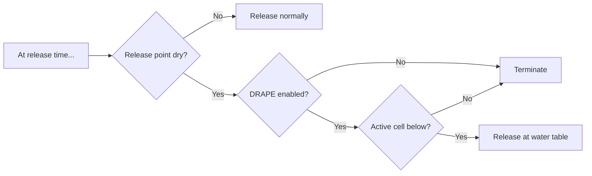
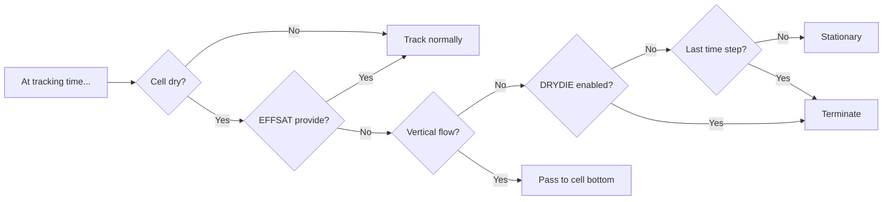

# Vertical tracking

This document describes the approach PRT takes to particle motion along the z axis. When a particle is immersed in the flow field, vertical motion can be treated identically to the lateral dimensions. Special handling is necessary above the water table.

**Note:** PRT model's particle release point (PRP) package implements particle release. This consists of registering each particle with an in-memory store from which the particle will be checked out later by the tracking algorithm. Release-time and tracking-time considerations are therefore described (as well as implemented) separately.

## The problem

What to do when a particle is in a dry cell? This can happen if a release point is above the water table, or if the water table drops below the particle, stranding it.

## The approach

At release time, PRT must decide whether to release the particle into the simulation, or to terminate it permanently unreleased. Do this on the basis of the `DRAPE` option, determining whether particles whose release location is dry should be "draped" down to the top-most active cell beneath, if any. If `DRAPE` is not enabled, terminate particles whose release point is dry immediately with status 8 (permanently unreleased).

At tracking time, PRT must decide whether a particle in a dry cell should terminate, or whether to simply leave it there and return to the question in a subsequent time step. Introduce 2 new tracking-time options:

|Name|Package|Description
|:--|:--|:--|
| `DRYDIE` | PRP | If any cell is (or goes) dry, terminate any particles inside it.
| `EFFSAT` | DIS | Effective cell saturation &mdash; substitute for saturation allowing particles to travel vertically through dry cells when the flow model uses the Newton-Raphson formulation.

On the simulation's last step, terminate stationary particles whether or not `EXTEND_TRACKING` is enabled, otherwise decide on the basis of `DRYDIE` and `EFFSAT`.

