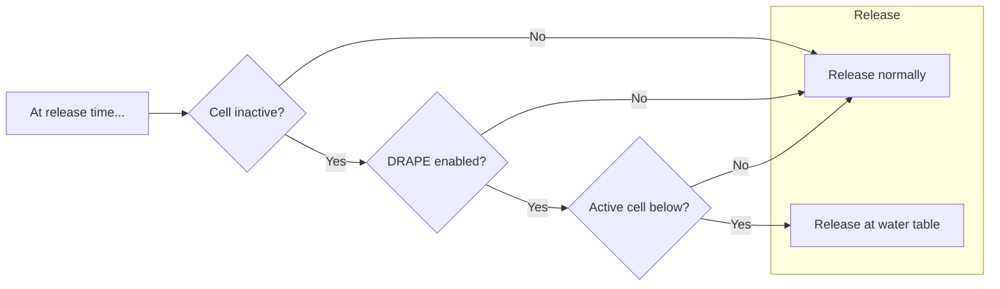
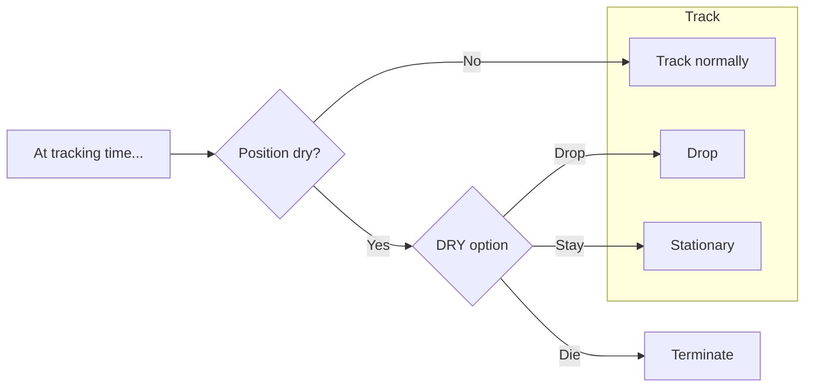

# Vertical tracking

This document describes the approach PRT takes to vertical particle motion.

When a particle is in the flow field, vertical motion can be solved in the same way as lateral motion. Special handling is necessary above the water table.

## The problem

The main question is what to do with particles under "dry" conditions.

There are two kinds of dry cells: inactive cells, and active-but-dry cells, as can occur with a flow model using the Newton formulation.

## The approach

Release-time and tracking-time considerations are described (as well as implemented) separately.

### Release time

At release time, if the release cell is active, the particle is released. Otherwise behavior depends on the `DRAPE` keyword option. If `DRAPE` is not enabled, the particle is released at the specified coordinates and any special handling is deferred to tracking time. If `DRAPE` is enabled, the particle is "draped" to the top-most active cell beneath it, if any, and released at the water table at the same lateral coordinates. If there is no active cell below the particle, it is released at the specified coordinates, as if `DRAPE` were disabled.

**Note**: This is a departure from version 6.5.0, in which a particle released in a dry position without `DRAPE`, or with `DRAPE` but no active cell below, would terminate unreleased with status code 8.

### Tracking time

At tracking time, a particle might find itself above the water table for one of two reasons:

- it was released above the water table
- the water table has receded beneath it

Typically, such a particle will terminate immediately with status code 7. This is consistent with MODPATH 7's behavior.

If the Newton formulation is used for the flow model, a dry cell can remain active. MODFLOW version 6.6.0 introduces a PRP package option `DRY` determining how particles should behave in this case. This option can take one of the following values:

- `die`
- `drop` (default)
- `stay`

If `die` is selected, particles terminate immediately in dry positions.

If `drop` is selected, or if the `DRY` option is unspecified, particles in a dry position are passed vertically and instantaneously to the bottom of the cell if it the cell is dry, or to the water table if it's within the cell. This was the behavior in version 6.5.0, and remains the default behavior.

If `stay` is selected, the particle will remain stationary until a) the cell rewets and tracking can continue, or b) particle tracking ceases (either at the end of the simulation's final time step, or when all other particles have terminated if `EXTEND_TRACKING` is enabled), at which point it is terminated.

