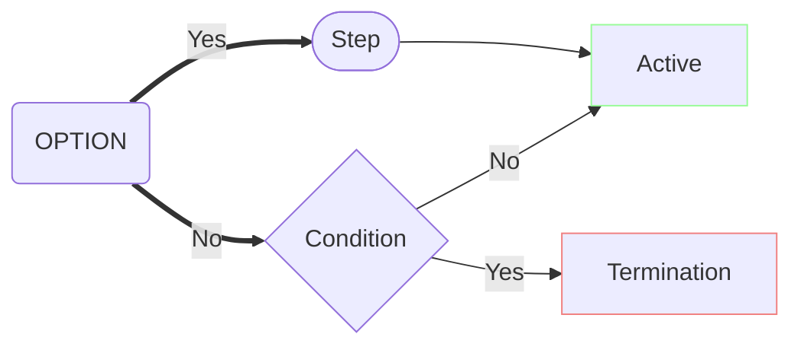
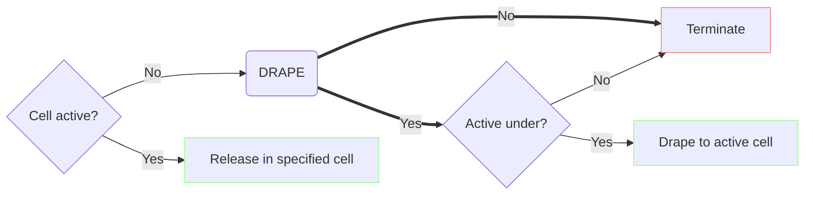
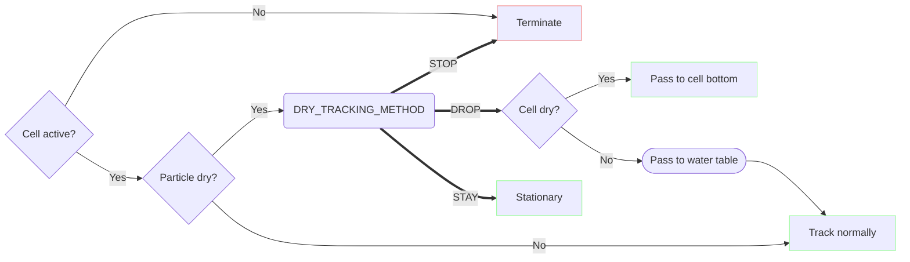

# Vertical tracking

This document describes the approach PRT takes to vertical particle motion.

## Legend

Diagrams use the following conventions.

* Stadium-shaped boxes represent steps or processes.
* Square boxes represent outcomes.
* Diamond boxes represent conditions (i.e. runtime state).
* Round-corner boxes represent user options.
* Thin lines represent decisions made by the program on the basis of runtime state, e.g. particle, cell, flows.
* Thick lines represent decisions made by the user by way of options.
* Green outcome boxes indicate the particle remains active.
* Red outcome boxes indicate the particle terminates.

## The problem

When a particle is in the flow field, vertical motion can be solved in the same way as lateral motion. Special handling is necessary above the water table.

A "dry" cell is either 1) an inactive cell or 2) an active-but-dry cell, as can occur with the Newton formulation.

Normally, an inactive cell might be dry or explicitly disabled (idomain).  With Newton, dry cells remain active.

## The approach

Release-time and tracking-time considerations are described (and implemented) separately.

Each particle is either released into the simulation, or terminates unreleased. In the former case the particle's first record will be reason 0 (release), status 1 (active). In the latter reason 3 (termination), status 8 (permanently unreleased).

At each time step, the PRT model applies the tracking method to each particle. The particle's trajectory is solved over the model grid until the end of the time step, or until the particle terminates, whichever occurs first.

Particles may traverse an arbitrary number of cells in a time step, in the lateral as well as vertical dimensions.

Sometimes it is convenient to avoid "stranding" particles &mdash; rather than terminating dry particles, it is often convenient instead to move them down to the saturated zone and continue tracking. PRT allows particles (and indeed configures them by default) to move instantaneously down to the water table in dry conditions.

### Release

At release time, PRT decides whether to release each particle or to terminate it unreleased.

If the release cell is active, the particle will be released at the specified coordinates.

If the release cell is inactive, behavior is determined by the `DRAPE` option. If the `DRAPE` option is enabled, the particle will be "draped" down to and released from the top-most active cell beneath it, if any. If there is no active cell underneath the particle in any layer, or if `DRAPE` is not enabled, the particle will terminate unreleased (with status code 8).

Since under the Newton formulation dry cells can remain active, the `DRAPE` option has no effect when Newton is on (assuming particles are not released into disabled grid regions). Vertical tracking behavior with Newton can be configured with tracking-time settings.

### Tracking

A particle might find itself above the water table for one of two reasons:

1. It was released above the water table.

    With the Newton formulation, particles can be released into dry-but-active cells.

2. The water table has receded.

    Particle trajectories are solved over the same time discretization used by the flow model. A particle may be immersed in the flow field in one time step, and find that the water table has dropped below it in the next.

Tracking and termination decisions are made on the basis of information like

1) a cell's active status
2) whether the cell is dry
3) whether the cell has outgoing flow across any face
4) whether the particle is dry (above the water table)
5) the particle's prior path

A particle which finds itself in an inactive cell will terminate with status code 7. This is consistent with MODPATH 7's behavior.

A particle in a dry-but-active cell, or above the water table in a partially saturated cell, need not terminate. MODFLOW version 6.6.0 introduces a new option `DRY_TRACKING_METHOD` for the PRP package, determining how dry particles should behave. Supported values are:

- `DROP` (default)
- `STOP`
- `STAY`

If `DROP` is selected, or if a `DRY_TRACKING_METHOD` is unspecified, a particle in a dry position is passed vertically and instantaneously to the water table (if the cell is partially saturated) or to the bottom of the cell (if the cell is dry). This repeats (i.e. the particle may drop through multiple cells) until it reaches the water table. Tracking then proceeds as usual.

**Note**: A divide-by-zero crash has been fixed for `gfortran`, which could occur upon a particle's entry into a dry cell in a structured grid.

If `STOP` is selected, dry particles will be terminated.

If `STAY` is selected, a dry particle will remain stationary until a) the cell rewets and tracking can continue or b) the simulation ends.

#### Caveat

In MF6.5, behavior was as described by `DROP`, with one major exception: lack of an exit face (i.e. any face with outgoing flow) took precedence over cell saturation; a particle finding itself in a dry cell with no outgoing flow would previously terminate, where if `DROP` is selected (or a dry tracking method unspecified) the pass-to-bottom method will now be applied instead.

With this change, it also becomes necessary to prohibit particle backtracking (i.e. re-entering the previous cell) within the same time step, in order to avoid the possibility of infinite loops. For instance, a particle might otherwise be passed endlessly between e.g. the bottom face of a cell containing a pumping well and the top face of the cell below.