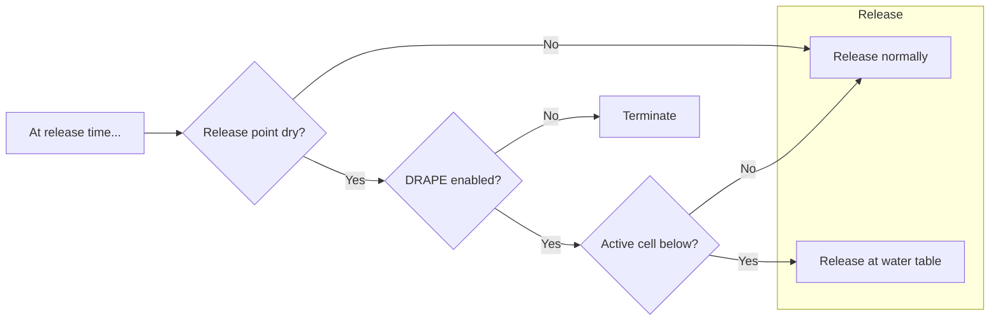
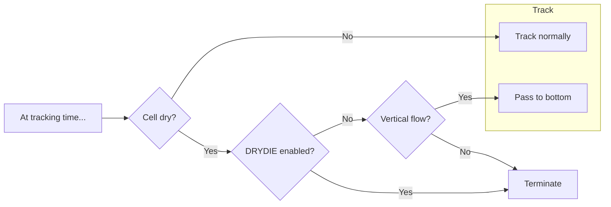

# Vertical tracking and cell drying/rewetting

When a particle is in the flow field, vertical motion can be treated the same as lateral motion. Special handling is necessary above the water table.

## Overview

This document describes the approach taken for vertical particle motion in "dry" conditions.

There are two kinds of dry cells: truly inactive cells, and dry-but-active cells, as can occur with Newton enabled for the flow model.

## Approach

PRT model's particle release point (PRP) package implements particle release. This consists of registering each particle with an in-memory store from which the particle will be checked out later by the tracking algorithm. Release-time and tracking-time considerations are therefore described (as well as implemented) separately.

### Release time

At release time, PRT decides whether to release a particle whose release position is dry, or to terminate it permanently unreleased. It does this on the basis of the `DRAPE` option. If `DRAPE` is enabled, the particle is dropped to the top-most active cell beneath it, if any, at the same lateral coordinates. Otherwise, the particle will terminate immediately with status code 8 (permanently unreleased).

If `DRAPE` is enabled but there is no active cell beneath a given particle release position, the particle is released normally (at the configured elevation) and then will terminate at tracking time with status 7 (stranded), consistent with the behavior of MODPATH 7.

### Tracking time

At tracking time, PRT decides whether to terminate a particle in a dry cell or pass it to the cell below. If the cell is dry but active, as can occur if Newton is enabled in the flow model, the `DRYDIE` option decides whether to pass the particle vertically and instantaneously to the cell bottom or to terminate it.

