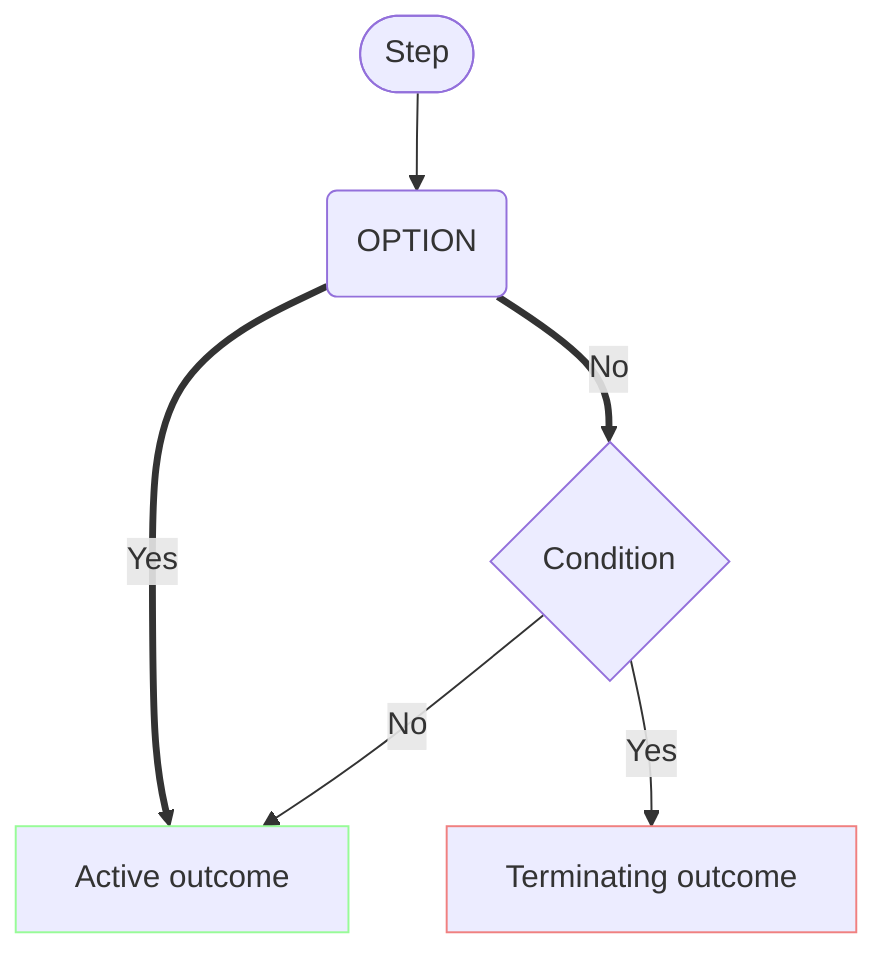
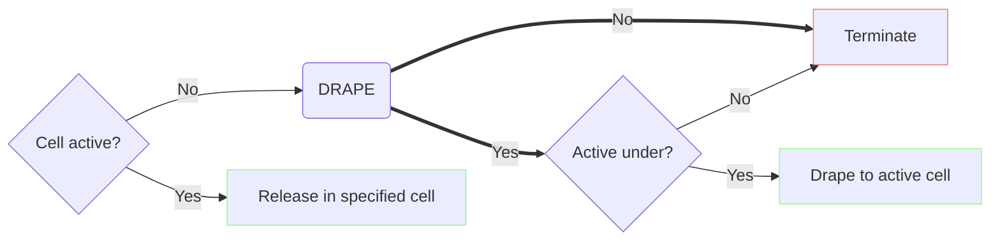
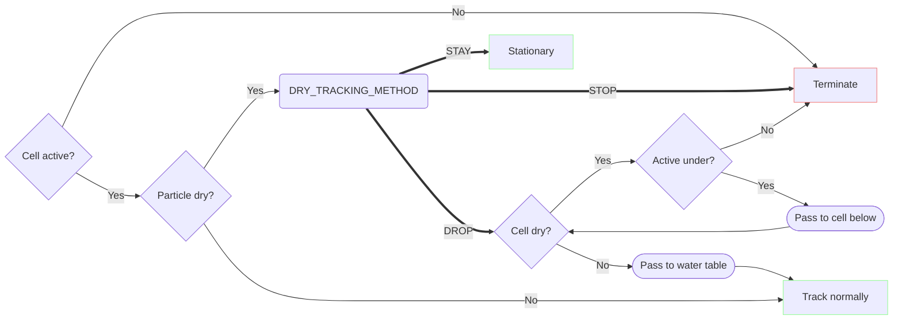

# Vertical tracking

This document describes the approach PRT takes to vertical particle motion.

When a particle is in the flow field, vertical motion can be solved in the same way as lateral motion. Special handling is necessary above the water table.

## Legend

A diagrams in this document represents a decision tree applied to each particle in a given context. Diagrams use the following conventions.

* Stadium-shaped boxes represent steps or processes.
* Square boxes represent outcomes.
* Diamond boxes represent conditions (i.e. runtime state).
* Rounded boxes represent user options.
* Thin lines represent decisions made by the program on the basis of conditions, e.g. particle, cell, flows.
* Thick lines represent decisions made by the user by way of options.
* Green outcome boxes indicate the particle remains active.
* Red outcome boxes indicate the particle terminates.

## The problem

The main question is what to do with particles under "dry" conditions.

There are two kinds of dry cells: inactive cells, and active-but-dry cells, as can occur with the Newton formulation.

## The approach

Release-time and tracking-time considerations are described (as well as implemented) separately.

### Release time

At release time, PRT decides whether to release each particle or to terminate it unreleased.

If the release cell is active, the particle will be released at the specified coordinates.

If the release cell is inactive, behavior is determined by the `DRAPE` option. If the `DRAPE` option is enabled, the particle will be "draped" down to and released from the top-most active cell beneath it, if any. If there is no active cell underneath the particle in any layer, or if `DRAPE` is not enabled, the particle will terminate with status code 8.

**Note**: Since under the Newton formulation dry cells can remain active, the `DRAPE` option will not be applied when Newton is enabled. Vertical tracking behavior with Newton can be configured with tracking-time settings.

### Tracking time

A particle might find itself above the water table for one of two reasons:

1. It was released above the water table.

    With the Newton formulation, dry cells can remain active, meaning particles can be released into them.

2. The water table has receded beneath it.

    Particle trajectories are solved over the same time discretization used by the flow model. A particle may be immersed in the flow field in one time step, and find that the water table has dropped below it on the next.

A particle which finds itself in an inactive cell will terminate with status code 7. This is consistent with MODPATH 7's behavior.

A particle in a dry-but-active cell, or above the water table in an active cell, need not terminate. MODFLOW version 6.6.0 introduces a new option `DRY_TRACKING_METHOD` for the PRP package, determining how dry particles should behave. Supported values are:

- `DROP` (default)
- `STOP`
- `STAY`

If `DROP` is selected, or if a `DRY_TRACKING_METHOD` is unspecified, a particle in a dry position is passed vertically and instantaneously to the water table (if the cell is partially saturated) or to the bottom of the cell (if the cell is dry). This repeats (i.e. the particle may drop through multiple cells) until it reaches the water table. Tracking then proceeds as usual.

If `STOP` is selected, dry particles will be terminated.

If `STAY` is selected, a dry particle will remain stationary until a) the cell rewets and tracking can continue or b) the simulation ends.

**Note**: In version 6.5.0, behavior was as described by `DROP`. This remains the default behavior in version 6.6.0.

**Note**: In each time step, PRT tracks each particle until the end of the time step, or until the particle encounters a termination condition, whichever occurs first. A particle may traverse an arbitrary number of cells in a single time step. Below, square boxes represent time-step outcomes, i.e. the state of the tracking algorithm at the end of the time step. Stadium-shaped boxes represent intermediate steps in the tracking algorithm.

