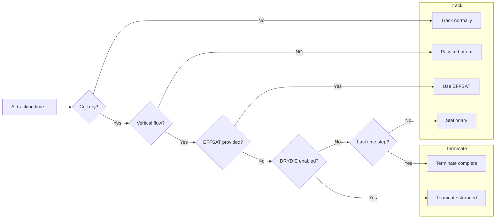

# Vertical tracking

This document describes the approach PRT takes to particle motion along the z axis. When a particle is immersed in the flow field, vertical motion can be treated identically to the lateral dimensions. Special handling is necessary above the water table.

**Note:** PRT model's particle release point (PRP) package implements particle release. This consists of registering each particle with an in-memory store from which the particle will be checked out later by the tracking algorithm. Release-time and tracking-time considerations are therefore described (as well as implemented) separately.

At release time, PRT must decide whether to release the particle into the simulation, or to terminate it permanently unreleased. It does this on the basis of the `DRAPE` option, which determines whether particles whose release position is in a dry cell should be dropped to the top-most active cell beneath it, if any, at the same lateral coordinates. If `DRAPE` is not enabled, particles whose release point is dry will terminate immediately with status 8 (permanently unreleased).

If `DRAPE` is enabled but there is no active cell beneath a given particle release location, the particle is released normally (at the configured elevation) and then will terminate at tracking time with status 7 (stranded).

At tracking time, PRT decides whether to terminate a particle in a dry cell or pass it to the cell below. If the cell is dry but active, as can occur if Newton is enabled in the flow model, the particle is passed instantaneously to the its bottom, i.e. to the cell below. Otherwise the particle terminates.

## Proposal

Introduce 2 new tracking-time options:

|Name|Package|Description
|:--|:--|:--|
| `DRYDIE` | PRP | If any cell is (or goes) dry, terminate any particles inside it.
| `EFFSAT` | DIS | Effective cell saturation &mdash; substitute for saturation allowing particles to travel vertically through dry cells when the flow model uses the Newton-Raphson formulation.

If the cell has vertical flow and an effective cell saturation is provided, tracking can proceed as usual. Without vertical flow and no `EFFSAT`, pass the particle instantaneously to the cell bottom.

If the cell has no vertical flow, `DRYDIE` decides whether to terminate it, unless it's the simulation's last step, in which case terminate stationary particles whether or not `EXTEND_TRACKING` is enabled.

